# Functional Specifications - 加油 HSK Flashcards

## 1. Overview

**加油 HSK Flashcards** is a Progressive Web App (PWA) designed for learning Chinese characters following HSK (Hanyu Shuiping Kaoshi) standards with Spanish translations.

### 1.1 Objective
Provide a modern and interactive tool to study Chinese characters through:
- Navigable flashcards with detailed information
- Training mode with automatic evaluation
- Interface optimized for mobile devices
- Offline functionality (PWA)

### 1.2 Core Technologies
- **SolidJS 1.8.7**: Reactive UI framework
- **TypeScript**: Static typing
- **Vite 5**: Build tool and development server
- **Tailwind CSS 3.4**: Utility-first CSS framework
- **Vitest**: Testing framework
- **vite-plugin-pwa 0.17.4**: PWA support with service workers

## 2. System Architecture

### 2.1 Navigation Structure

```
App (Main Router)
├─ Home (Home page)
│  ├─ HSK level selection (1, 2, 3)
│  └─ Mode selection (Cards / Training)
├─ Tarjetas (Free study mode)
│  ├─ Character navigation
│  ├─ Card flip system
│  └─ Pleco integration
└─ Entrenamiento (Practice mode)
   ├─ Randomized quiz
   ├─ Scoring system
   └─ Final results
```

### 2.2 Global State Flow

The application state is managed through **SolidJS Store** in `characterStore.ts`:

```typescript
interface CharacterStore {
    characters: HSKCharacter[];      // All characters (HSK 1-3)
    selectedLevel: number | null;    // Selected HSK level
    currentIndex: number;            // Current character index
    trainingMode: boolean;           // Whether in training mode
    trainingResults: {               // Training results
        correct: number;
        incorrect: number;
    };
}
```

**Persistence**: Progress (selected level and current index) is saved in `localStorage` with the key `hsk-flashcards-progress`.

## 3. Data Model

### 3.1 HSK Character Structure

Each character contains:

```typescript
interface HSKCharacter {
    character: string;           // Simplified character
    traditional: string;         // Traditional character
    pinyin: string;             // Pronunciation
    definition: string;         // Spanish definition
    radical: string;            // Character radical
    stroke_count: number;       // Number of strokes
    hsk_level: 1 | 2 | 3 | 4 | 5 | 6;  // HSK level
    general_standard: number;   // General standard
    frequency_rank: number;     // Frequency ranking
}
```

### 3.2 Character Database

Data is distributed across JSON files:
- **HSK 1**: `src/data/hsk1.json` (174 characters)
- **HSK 2**: `src/data/hsk2.json` (173 characters)
- **HSK 3**: `src/data/hsk3.json` (270 characters)
- **Total**: 617 characters

Data source: http://hanzidb.org

## 4. Main Components

### 4.1 App.tsx (Main Router)

**Responsibility**: Navigation control between pages.

**Local State**:
- `currentPage`: Current page ('home' | 'tarjetas' | 'entrenamiento')

**Functions**:
- `handleNavigate(page)`: Changes to specified page
- `handleGoHome()`: Returns to home page

### 4.2 Home.tsx (Home Page)

**Responsibility**: HSK level and study mode selection.

**Flow**:
1. User selects HSK level (1, 2 or 3)
2. `characterStore.selectLevel(level)` is executed
3. Buttons are shown to choose mode:
   - **📚 Tarjetas**: Free study mode
   - **🎯 Entrenamiento**: Practice mode

### 4.3 Tarjetas.tsx (Flashcards Mode)

**Responsibility**: Free navigation through characters with complete information.

**Features**:
- Navigation via swipe or buttons (← →)
- Tap to flip card
- Pleco search button (🔍)
- Progress counter (X/Total)
- Visual swipe indicators

**Events**:
- `handleSwipeLeft()`: Next character
- `handleSwipeRight()`: Previous character
- `handleOpenPleco()`: Opens Pleco with current character

### 4.4 Entrenamiento.tsx (Training Mode)

**Responsibility**: Interactive quiz with automatic evaluation.

**Training Logic**:

1. **Start**: Characters are shuffled randomly
2. **Evaluation**:
   - ✓ (swipe right): Correct answer
   - ✗ (swipe left): Incorrect answer
   - **Flip**: If user flips the card to see translation, it automatically counts as **incorrect**

3. **Flip Behavior**:
   ```typescript
   const handleFlip = () => {
       if (!hasFlipped()) {
           setHasFlipped(true);
           characterStore.recordAnswer(false);  // Counts as error
           // User must advance manually
       }
   };
   ```

4. **Advancement**:
   - If has NOT seen translation: answer ✓/✗ and advance automatically
   - If ALREADY saw translation: must advance manually (error already registered)

5. **Visual Feedback**:
   - Animation of ✓ or ✗ for 500ms
   - "✗ Viewed" indicator if translation was seen

6. **Completion**:
   - After all cards, shows modal with results
   - Statistics: correct, incorrect, total, percentage
   - Options: Repeat or Go Home

### 4.5 Card.tsx (Flip Card)

**Responsibility**: Card rendering with 3D flip animation.

**Structure**:
- **Front**: Large Chinese character and pinyin
- **Back**:
  - Simplified and traditional character
  - Pinyin
  - Spanish definition
  - Radical, strokes, HSK level
  - Frequency ranking

**Animation**: CSS 3D transform with `perspective` and `rotateY`.

### 4.6 SwipeableCard.tsx (Swipeable Card)

**Responsibility**: Card wrapper with gesture detection.

**Features**:
- Swipe detection (touch and mouse)
- Visual drag with rotation and displacement
- Prevention of accidental flip during swipe
- Direction indicators (⬅️ ➡️)

**Anti-Flip Logic**:
```typescript
const handleRootClick = () => {
    // Only flip if there was NO recent movement
    if (!hadMovement()) {
        setIsFlipped(!isFlipped());
        props.onFlip?.();
    }
};
```

### 4.7 ScoreModal.tsx (Results Modal)

**Responsibility**: Display training final results.

**Content**:
- Total characters
- Correct answers (✓)
- Incorrect answers (✗)
- Success percentage
- Buttons: "🔄 Repeat" and "🏠 Home"

### 4.8 LevelSelector.tsx (Level Selector)

**Responsibility**: Buttons to select HSK level.

**Features**:
- Shows character count per level
- Active button visually differentiated
- Callback `onSelect(level)`

### 4.9 ProgressBar.tsx (Progress Bar)

**Responsibility**: Visual progress indicator.

**Props**:
- `current`: Current index
- `total`: Total elements
- Shows animated progress bar

## 5. Swipe Detection System

### 5.1 SwipeDetector Class

**File**: `src/utils/swipeDetection.ts`

**Responsibilities**:
- Detect swipe gestures (touch and mouse)
- Distinguish between swipe, drag and tap
- Prevent conflicts with native scroll

**Configuration**:
```typescript
minSwipeDistance: 50px        // Minimum distance for swipe
maxSwipeTime: 500ms           // Maximum time for swipe
maxTapTime: 300ms             // Maximum time for tap
maxTapDistance: 10px          // Maximum distance for tap
```

**Events**:
- `onSwipeLeft`: Swipe left
- `onSwipeRight`: Swipe right
- `onTap`: Simple tap
- `onDrag`: Drag in progress
- `onDragEnd`: End of drag

**Scroll Prevention**:
```typescript
element.style.touchAction = 'pan-y';  // Vertical scroll only
```

### 5.2 Detection Algorithm

1. **Touch/Mouse Start**: Records initial position and timestamp
2. **Touch/Mouse Move**:
   - Calculates deltaX and deltaY
   - If movement is more horizontal than vertical: `preventDefault()`
   - Notifies drag for visual feedback
3. **Touch/Mouse End**:
   - **Tap**: If distance < 10px and time < 300ms
   - **Swipe**: If distance > 50px, more horizontal than vertical, and time < 500ms
   - Determines direction (left/right)

## 6. Pleco Integration

**File**: `src/utils/plecoIntegration.ts`

**Function**:
```typescript
openInPleco(character: string): void
```

**Implementation**:
- Uses Pleco URL scheme: `plecoapi://x-callback-url/s?q=CHARACTER`
- `window.open(url, '_blank')` to open in Pleco
- Validation: `isValidForPleco()` verifies character is not empty

**Usage**: 🔍 button in Cards mode opens Pleco with current character for detailed lookup.

## 7. Progressive Web App (PWA)

### 7.1 Service Worker

**Plugin**: `vite-plugin-pwa`

**Features**:
- Strategy: Offline-first with precaching
- Cached assets: HTML, CSS, JS, images, icons, JSON data
- Automatic cache update on new versions

### 7.2 Manifest

**File**: `manifest.webmanifest`

**Content**:
- Name: "加油 HSK Flashcards"
- Icons: 192x192, 512x512, favicon
- Display: standalone
- Theme color: App's main color
- Start URL: /

### 7.3 Installation

The app can be installed as a native application on:
- Android (Chrome, Edge)
- iOS (Safari - "Add to Home Screen")
- Desktop (Chrome, Edge)

## 8. Styling System

### 8.1 Tailwind CSS

**Configuration**: `tailwind.config.js`

**Features**:
- Utility-first approach
- Custom classes for glassmorphism effects
- Custom animations

### 8.2 Glassmorphism

**Custom classes** (defined in `index.css`):
```css
.glass-card {
    background: rgba(255, 255, 255, 0.1);
    backdrop-filter: blur(10px);
    border: 1px solid rgba(255, 255, 255, 0.2);
}

.glass-button {
    background: rgba(255, 255, 255, 0.15);
    backdrop-filter: blur(10px);
    border: 1px solid rgba(255, 255, 255, 0.3);
}
```

### 8.3 CSS Animations

- **3D Flip**: `transform: rotateY(180deg)` with `perspective`
- **Drag**: `translate()` and `rotate()` in real-time
- **Bounce**: Visual feedback for correct/incorrect answer
- **Slide-in**: Swipe indicators

## 9. State Management

### 9.1 CharacterStore (Global State)

**Operations**:

**Level Selection**:
```typescript
selectLevel(level: number) -> void
```
- Sets selected level
- Resets index to 0
- Saves to localStorage

**Navigation**:
```typescript
nextCharacter() -> void
previousCharacter() -> void
setCurrentIndex(index: number) -> void
```
- Circular navigation (wrap-around)
- Auto-save to localStorage

**Filtering**:
```typescript
getCharactersByLevel() -> HSKCharacter[]
getShuffledCharacters() -> HSKCharacter[]
```
- `getCharactersByLevel()`: Filter by selected level
- `getShuffledCharacters()`: Randomized for training

**Training**:
```typescript
startTraining() -> void
recordAnswer(isCorrect: boolean) -> void
getTrainingResult() -> TrainingResult
resetTraining() -> void
```

### 9.2 LocalStorage Persistence

**Key**: `hsk-flashcards-progress`

**Saved data**:
```json
{
    "selectedLevel": 1,
    "currentIndex": 42
}
```

**Load on start**:
```typescript
const loadProgress = (): Partial<CharacterStore> => {
    const saved = localStorage.getItem(STORAGE_KEY);
    return saved ? JSON.parse(saved) : {};
};
```

## 10. Testing

### 10.1 Framework

**Vitest** with **@solidjs/testing-library**

### 10.2 Implemented Tests

**Card.test.tsx**:
- Content rendering
- Flip animation
- Correct props

**characterStore.test.ts**:
- Level selection
- Navigation
- Character filtering
- Training logic
- Persistence

**plecoIntegration.test.ts**:
- Correct URL generation
- Character validation
- Error handling

**swipeDetection.test.ts**:
- Swipe left/right detection
- Tap detection
- Drag tracking
- Correct thresholds

## 11. User Flows

### 11.1 Flashcard Study Flow

```mermaid
graph TD
    A[Home] --> B[Select HSK Level]
    B --> C[Click 'Tarjetas']
    C --> D[View Character]
    D --> E{Action}
    E -->|Tap| F[Flip - See Translation]
    F --> D
    E -->|Swipe L/R| G[Next/Previous]
    G --> D
    E -->|Click 🔍| H[Open in Pleco]
    H --> D
    E -->|← Home| A
```



### 11.2 Training Flow

```mermaid
graph TD
    A[Home] --> B[Select HSK Level]
    B --> C[Click 'Entrenamiento']
    C --> D[View Random Character]
    D --> E{Know answer?}
    E -->|Yes| F[Swipe ✓]
    E -->|No| G[Swipe ✗]
    E -->|Not sure| H[Tap - See Translation]
    H --> I[Mark as ✗ automatically]
    I --> J[User must advance manually]
    F --> K[Next Character]
    G --> K
    J --> K
    K --> L{More remaining?}
    L -->|Yes| D
    L -->|No| M[Results Modal]
    M --> N{Action}
    N -->|Repeat| C
    N -->|Home| A
```



## 12. Responsive Design

### 12.1 Breakpoints

Standard Tailwind breakpoints:
- **sm**: 640px
- **md**: 768px
- **lg**: 1024px
- **xl**: 1280px

### 12.2 Mobile Optimizations

- Touch-optimized buttons (minimum size 44x44px)
- `touch-action: pan-y` to prevent swipe interference
- Font scaling with `text-base md:text-lg` classes
- Compact spacing on mobile (`p-3`), more generous on desktop
- Full screen height: `h-screen`
- Vertical scroll only when necessary

### 12.3 Overflow Prevention

```css
overflow-x-hidden
w-full
max-w-full
overflow-y-hidden
```

Applied in:
- `App` component
- `Tarjetas` and `Entrenamiento` pages

## 13. Accessibility Features

### 13.1 Keyboard

- Arrow keys ←/→ for navigation (implemented in components)
- Visible focus on buttons
- Functional tab navigation

### 13.2 Semantic

- Use of `<button>` for interactive elements
- `title` attribute on icon buttons
- Clear hierarchical structure

### 13.3 Visual

- Adequate contrast (white text on dark/transparent backgrounds)
- Visual state indicators (disabled, hover, active)
- Immediate interaction feedback

## 14. Performance

### 14.1 Optimizations

- **Lazy evaluation**: SolidJS signals only recalculate when dependencies change
- **No Virtual DOM**: SolidJS compiles to direct DOM updates
- **Code Splitting**: Vite automatically splits code into chunks
- **Asset Optimization**: Vite minifies and optimizes in build
- **Service Worker Caching**: Assets served from local cache

### 14.2 Bundle Size

Production build generates:
- `index.js`: Application code
- `index.css`: Compiled styles
- Static assets: images, icons, JSON data

Tailwind optimization: PurgeCSS removes unused classes.

## 15. Known Limitations

### 15.1 Data

- Only HSK 1-3 included (617 characters)
- Fixed Spanish translations
- No pronunciation audio

### 15.2 Functionality

- No spaced repetition system (SRS)
- No historical statistics saved
- No cross-device synchronization
- No selectable dark/light mode
- No character search

### 15.3 Pleco

- Integration depends on Pleco being installed
- Only works on iOS/Android (not web)
- URL scheme may not work in all contexts

## 16. Potential Future Improvements

### 16.1 Pending Features

- [ ] HSK 4, 5, 6
- [ ] Spaced Repetition System (SRS)
- [ ] Historical statistics and progress charts
- [ ] Character search by pinyin or definition
- [ ] Dark/light mode
- [ ] Pronunciation audio
- [ ] Usage examples in sentences
- [ ] Compound word flashcards (不好, 中国, etc.)
- [ ] Favorites/bookmarks system
- [ ] Progress export/import

### 16.2 Integrations

- [ ] User account synchronization
- [ ] Integration with other dictionaries (MDBG, CC-CEDICT)
- [ ] Share progress on social media
- [ ] Competition with other users

## 17. Development Commands

```bash
# Install dependencies
npm install

# Development server (http://localhost:5173)
npm run dev

# Production build
npm run build

# Build preview
npm run preview

# Run tests
npm test

# Tests with UI
npm run test:ui
```

## 18. File Structure

```
src/
├── components/          # Reusable components
│   ├── Card.tsx              # Card with 3D flip
│   ├── SwipeableCard.tsx     # Card with swipe detection
│   ├── LevelSelector.tsx     # HSK level selector
│   ├── ProgressBar.tsx       # Progress bar
│   └── ScoreModal.tsx        # Results modal
├── pages/              # Main pages
│   ├── Home.tsx              # Home with selection
│   ├── Tarjetas.tsx          # Flashcards mode
│   └── Entrenamiento.tsx     # Training mode
├── stores/             # Global state
│   └── characterStore.ts     # Character and progress store
├── utils/              # Utilities
│   ├── swipeDetection.ts     # Gesture detection system
│   └── plecoIntegration.ts   # Pleco integration
├── data/               # JSON data
│   ├── hsk1.json
│   ├── hsk2.json
│   └── hsk3.json
├── types.ts            # TypeScript definitions
├── index.css           # Global styles + Tailwind
├── index.tsx           # Entry point
└── App.tsx             # Root component with routing
```

## 19. Main Dependencies

### 19.1 Production

```json
{
  "solid-js": "^1.8.7"
}
```

### 19.2 Development

```json
{
  "@solidjs/testing-library": "^0.8.5",
  "@testing-library/jest-dom": "^6.1.5",
  "autoprefixer": "^10.4.16",
  "postcss": "^8.4.32",
  "tailwindcss": "^3.4.0",
  "typescript": "^5.3.3",
  "vite": "^5.0.8",
  "vite-plugin-pwa": "^0.17.4",
  "vite-plugin-solid": "^2.8.2",
  "vitest": "^1.1.0",
  "workbox-window": "^7.0.0"
}
```

## 20. Browser Support

### 20.1 Minimum Requirements

- **Chrome/Edge**: 90+
- **Safari**: 14+
- **Firefox**: 88+
- **Chrome Mobile**: Latest version
- **iOS Safari**: 14+

### 20.2 Required Features

- CSS Grid and Flexbox
- CSS 3D Transforms
- Touch Events API
- LocalStorage API
- Service Workers (for PWA)
- ES2020+

---

**Document Version**: 1.0
**Date**: 2024
**Author**: 加油 HSK Flashcards Development Team
